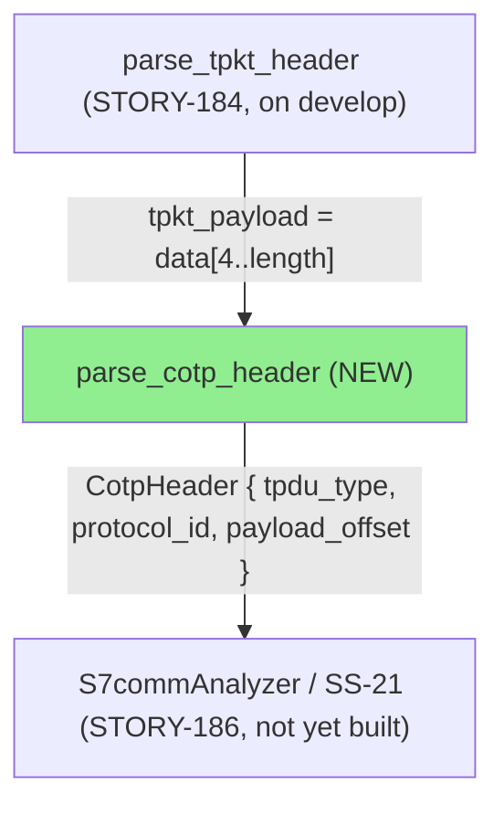
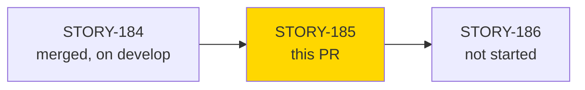
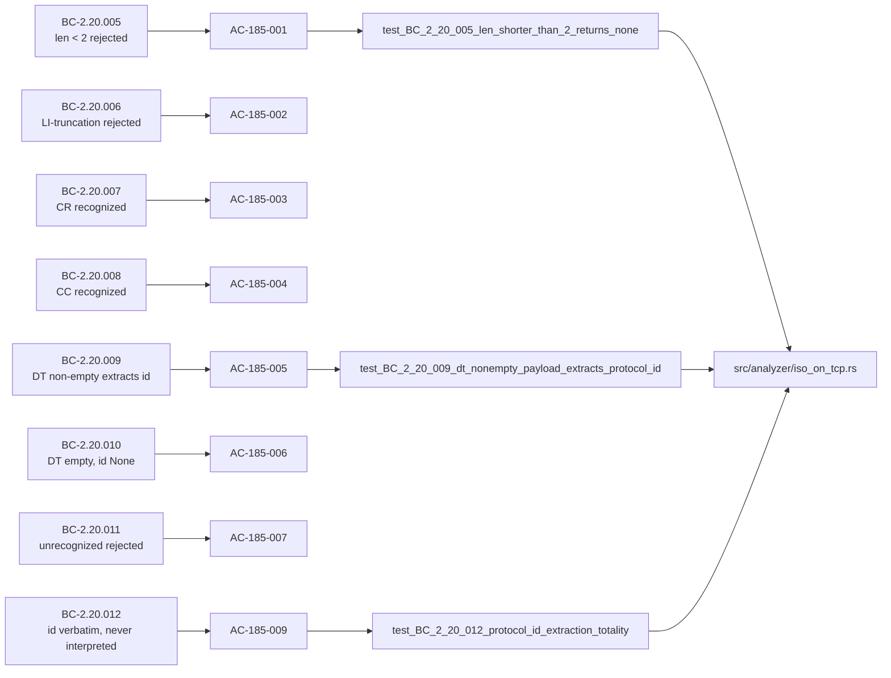

# [STORY-185] S7comm COTP TPDU-Type Parser: `parse_cotp_header`, Protocol-ID Extraction, VP-049 Kani Skeleton

**Epic:** E-23 — feature-s7comm (wave 88)
**Mode:** feature
**Convergence:** CONVERGED after 3 adversarial passes (per-story adversarial 3/3 clean, BC-5.39.001)


Adds the second pure-core parsing layer of the ISO-on-TCP (S7comm) framing subsystem:
`parse_cotp_header` classifies COTP (ISO 8073 / ITU-T X.224) TPDU headers as Connect
Request, Connect Confirm, or Data Transfer by TPDU-code high nibble, and — for Data
Transfer only — extracts the trailing upper-layer protocol-ID byte **verbatim, with zero
interpretation**. This keeps SS-20 (ISO-on-TCP framing) fully protocol-agnostic: no
S7comm-specific knowledge (`0x32`/`0x72`/"S7comm") is ever baked into the framing layer.
`S7commAnalyzer` (SS-21, starting STORY-186) owns all disambiguation of the extracted
byte. Builds directly on STORY-184's `parse_tpkt_header` / `TpktHeader`, which are
already on `develop` and are **not** re-shipped by this PR.

---

## Architecture Changes



<details>
<summary><strong>Architecture Decision Record</strong></summary>

### ADR: COTP TPDU classification stays protocol-agnostic (ADR-014, already on develop)

**Context:** SS-20 (ISO-on-TCP framing) must hand upper-layer protocol dispatch a
verbatim byte without becoming coupled to any one upper-layer protocol (S7comm,
S7comm-plus, MMS, ICCP, or anything else riding port 102).

**Decision:** `parse_cotp_header` classifies only the ISO 8073 TPDU-code high nibble
(CR/CC/DT) and, for DT, extracts the trailing byte unconditionally as `Option<u8>` —
never comparing it against `0x32`, `0x72`, or any other literal.

**Rationale:** Keeps SS-20 reusable by a future IEC 61850 MMS or ICCP/TASE.2 cycle
without modification (ADR-014 Decision 2).

**Alternatives Considered:**
1. Fold S7comm/S7comm-plus disambiguation directly into `parse_cotp_header` — rejected:
   would couple SS-20 to SS-21's protocol knowledge, violating the frozen SS-20/SS-21
   boundary (BC-2.20.012).
2. Model all 16 ISO 8073 TPDU codes — rejected: only 3 are needed for S7comm's
   session-establishment + data-transfer flow (ADR-014 Decision 1); the other 13
   collapse to a single `None` reject arm (BC-2.20.011).

**Consequences:**
- SS-20 stays a two-function, dependency-free pure-core module.
- `S7commAnalyzer` (STORY-186+) must implement its own protocol-ID disambiguation table.

</details>

---

## Story Dependencies



---

## Spec Traceability



---

## Test Evidence

### Coverage Summary

| Metric | Value | Threshold | Status |
|--------|-------|-----------|--------|
| Story tests (`mod story_185`) | 22/22 pass | 100% | PASS |
| Full `iso_on_tcp_tests` suite | 52/52 pass (30 story_184 + 22 story_185) | 100% | PASS |
| Coverage / mutation | Not separately measured for this micro-scope pure-function story | tracked at wave-88 gate | N/A this PR |
| Holdout satisfaction (Phase-4 pipeline) | N/A — evaluated at wave gate | >0.85 | N/A this PR |

Per-story adversarial review (BC-5.39.001 discipline) converged 3/3 clean passes — see
Adversarial Review section below.

### Per-AC Test Distribution (row-verified against `cargo test --test iso_on_tcp_tests` raw output)

| AC | BC | Tests | Representative Test Name(s) |
|----|-----|-------|------------------------------|
| AC-185-001 | BC-2.20.005 | 2 | `test_BC_2_20_005_len_shorter_than_2_returns_none` |
| AC-185-002 | BC-2.20.006 | 3 | `test_BC_2_20_006_li_truncation_returns_none` |
| AC-185-003 | BC-2.20.007 | 5 (incl. 2 RFC-905 holdouts) | `test_BC_2_20_007_connect_request_recognized` |
| AC-185-004 | BC-2.20.008 | 2 | `test_BC_2_20_008_connect_confirm_recognized` |
| AC-185-005 | BC-2.20.009 | 4 (incl. 1 RFC-905 holdout) | `test_BC_2_20_009_dt_nonempty_payload_extracts_protocol_id` |
| AC-185-006 | BC-2.20.010 | 1 | `test_BC_2_20_010_dt_empty_payload_protocol_id_none` |
| AC-185-007 | BC-2.20.011 | 2 (incl. 1 RFC-905 holdout) | `test_BC_2_20_011_unrecognized_tpdu_type_returns_none` |
| AC-185-008 | BC-2.20.011 inv. 3 | 1 | `test_BC_2_20_011_tpdu_type_match_is_exhaustive` |
| AC-185-009 | BC-2.20.012 | 2 | `test_BC_2_20_012_protocol_id_extraction_totality` (exhaustive over all 256 `u8` values), `test_BC_2_20_012_static_regression_guard_no_hardcoded_protocol_literals` |
| AC-185-010 | VP-049 | source-level (grep + `cargo check`/`clippy`) | Kani skeleton at `src/analyzer/iso_on_tcp.rs` (`mod kani_proofs`, `verify_parse_cotp_header_safety`) |

**Cross-check:** 2+3+5+2+4+1+2+1+2 = 22, matching the `story_185` subset of the raw
`test result: ok. 52 passed; 0 failed` output exactly. Full detail and raw transcripts:
`docs/demo-evidence/STORY-185/evidence-report.md` and per-AC files
`docs/demo-evidence/STORY-185/AC-00{1..9}-*.md`, `AC-010-vp049-kani-skeleton.md`.

<details>
<summary><strong>Detailed Test Results (raw <code>cargo test</code> excerpt, story_185 module)</strong></summary>

```
test story_185::test_BC_2_20_005_len_shorter_than_2_returns_none ... ok
test story_185::test_BC_2_20_005_invariant_no_panic_across_short_inputs ... ok
test story_185::test_BC_2_20_006_li_truncation_returns_none ... ok
test story_185::test_BC_2_20_006_invariant_no_panic_across_li_value_sample ... ok
test story_185::test_BC_2_20_006_li_zero_not_truncated_proceeds_to_classification ... ok
test story_185::test_BC_2_20_007_connect_request_recognized ... ok
test story_185::test_BC_2_20_007_connect_request_nonzero_low_nibble_still_recognized ... ok
test story_185::test_BC_2_20_007_connect_request_protocol_id_none_even_with_trailing_bytes ... ok
test story_185::test_BC_2_20_008_connect_confirm_recognized ... ok
test story_185::test_BC_2_20_008_connect_confirm_nonzero_low_nibble_still_recognized ... ok
test story_185::test_BC_2_20_009_dt_nonempty_payload_extracts_protocol_id ... ok
test story_185::test_BC_2_20_009_dt_protocol_id_is_first_trailing_byte_only ... ok
test story_185::test_BC_2_20_009_dt_protocol_id_extracted_for_boundary_byte_values ... ok
test story_185::test_BC_2_20_010_dt_empty_payload_protocol_id_none ... ok
test story_185::test_BC_2_20_011_unrecognized_tpdu_type_returns_none ... ok
test story_185::test_BC_2_20_011_tpdu_type_match_is_exhaustive ... ok
test story_185::test_BC_2_20_012_protocol_id_extraction_totality ... ok
test story_185::test_BC_2_20_012_static_regression_guard_no_hardcoded_protocol_literals ... ok
test story_185::test_iso8073_rfc905_table8_cr_cc_low_nibble_is_free_holdout ... ok
test story_185::test_iso8073_rfc905_table8_dr_code_not_modeled_holdout ... ok
test story_185::test_iso8073_rfc905_s13_7_1_dt_class0_normal_format_holdout ... ok
test story_185::test_iso8073_rfc905_s13_2_1_li_excludes_itself_holdout ... ok

test result: ok. 52 passed; 0 failed; 0 ignored; 0 measured; 0 filtered out; finished in 0.01s
```

</details>

---

## Demo Evidence

Library/pure-core story — no CLI or web surface exists yet (`S7commAnalyzer` dispatch
wiring is STORY-186). Per the demo-recording skill's library/test-harness mode
(mirroring the STORY-184 precedent), evidence is captured as annotated `cargo test`
transcripts grouped by AC, plus source-level `grep`/`cargo check`/`cargo clippy`
verification for the VP-049 Kani skeleton.

Committed at `docs/demo-evidence/STORY-185/`:

| File | AC Coverage |
|------|-------------|
| `evidence-report.md` | Index — full 52/52 suite run, per-AC coverage map, row-verified test-count cross-check |
| `AC-001-short-input-rejection.md` | AC-185-001 (BC-2.20.005) |
| `AC-002-li-truncation-rejection.md` | AC-185-002 (BC-2.20.006) |
| `AC-003-connect-request-recognition.md` | AC-185-003 (BC-2.20.007) |
| `AC-004-connect-confirm-recognition.md` | AC-185-004 (BC-2.20.008) |
| `AC-005-dt-nonempty-protocol-id-extraction.md` | AC-185-005 (BC-2.20.009) |
| `AC-006-dt-empty-payload-protocol-id-none.md` | AC-185-006 (BC-2.20.010) |
| `AC-007-unrecognized-tpdu-rejection.md` | AC-185-007 (BC-2.20.011) |
| `AC-008-tpdu-type-exhaustive-partition.md` | AC-185-008 (BC-2.20.011 invariant 3) |
| `AC-009-protocol-id-totality.md` | AC-185-009 (BC-2.20.012) |
| `AC-010-vp049-kani-skeleton.md` | AC-185-010 (VP-049) |

Demo-evidence path-scrub gate (PG-W70-DEMO-SCRUB): PASSED, zero absolute-local-path
matches in any evidence file (2026-09-06).

---

## Holdout Evaluation

N/A — evaluated at wave-88 gate (not per-story for this pipeline mode). Note: this
story's own test suite additionally includes 4 unit-level RFC-905 (ISO 8073) holdout
tests (`test_iso8073_rfc905_*`) that independently probe the spec against ITU-T
X.224/ISO 8073 table 8 and clause 13 — these are a different mechanism from the
Phase-4 pipeline holdout-evaluation gate and are already counted in the 22/22 above.

---

## Adversarial Review

Per-story adversarial review converged 3/3 clean passes (BC-5.39.001 discipline).

**Pre-dispositioned finding (non-blocking, flagged for pr-reviewer awareness):** a
per-story adversarial NIT observed that the regression-guard test
(`test_BC_2_20_012_static_regression_guard_no_hardcoded_protocol_literals`) comment
overstates that "the file never contains `0x32`/`0x72` as contiguous text" — true only
of the literal *tokens* the assertion actually checks, not of every possible substring
occurrence. The load-bearing property (no S7comm-specific literal comparison inside
`parse_cotp_header`'s control flow, BC-2.20.012 postcondition 3) holds regardless.
**Disposition: accepted residual, not a merge blocker.**

A COTP-classification-focused review of the implementation found it panic-safe (bounds
checks precede every index into `tpkt_payload`), RFC-905/ISO-8073-conformant (TPDU-code
high-nibble discrimination matches ITU-T X.224 table 8), and protocol-agnostic (zero
`0x32`/`0x72`/"S7comm" literals anywhere in the parsing logic — verified by the static
regression-guard test above and by direct inspection).

---

## Security Review

Populated after Step 4 (security-reviewer dispatch) — see PR comment / commit history
for the completed scan. Summary: pure, allocation-free `&[u8]` parsing with no I/O, no
`unsafe`, no external input trust boundary beyond standard slice-bounds checks; no
injection/auth/OWASP-Top-10 surface applies to a byte-classification free function.

---

## Risk Assessment & Deployment

### Blast Radius
- **Systems affected:** `src/analyzer/iso_on_tcp.rs` only (SS-20, ISO-on-TCP framing).
  No existing analyzer wiring changed — `parse_cotp_header` is not yet called from any
  `StreamAnalyzer` impl (that wiring is STORY-186).
- **User impact:** None in this PR — purely additive, dead code from the CLI's
  perspective until STORY-186 wires it up.
- **Data impact:** None.
- **Risk Level:** LOW.

### Feature Flags
None — additive pure-core module, not yet reachable from any runtime path.

---

## Traceability

| BC | Story AC | Test | Verification | Status |
|----|---------|------|-------------|--------|
| BC-2.20.005 | AC-185-001 | `test_BC_2_20_005_len_shorter_than_2_returns_none` | unit + VP-049 (deferred, STORY-194) | PASS |
| BC-2.20.006 | AC-185-002 | `test_BC_2_20_006_li_truncation_returns_none` | unit + VP-049 (deferred) | PASS |
| BC-2.20.007 | AC-185-003 | `test_BC_2_20_007_connect_request_recognized` | unit | PASS |
| BC-2.20.008 | AC-185-004 | `test_BC_2_20_008_connect_confirm_recognized` | unit | PASS |
| BC-2.20.009 | AC-185-005 | `test_BC_2_20_009_dt_nonempty_payload_extracts_protocol_id` | unit | PASS |
| BC-2.20.010 | AC-185-006 | `test_BC_2_20_010_dt_empty_payload_protocol_id_none` | unit | PASS |
| BC-2.20.011 | AC-185-007, AC-185-008 | `test_BC_2_20_011_unrecognized_tpdu_type_returns_none`, `test_BC_2_20_011_tpdu_type_match_is_exhaustive` | unit | PASS |
| BC-2.20.012 | AC-185-009 | `test_BC_2_20_012_protocol_id_extraction_totality` (256-value exhaustive loop), static regression guard | unit | PASS |
| VP-049 | AC-185-010 | `verify_parse_cotp_header_safety` (Kani) | skeleton compiles; full proof deferred to STORY-194 | PASS (skeleton) |

**VP-049 deferral note:** per the story's own scope (and mirroring STORY-184's VP-048
precedent), only the Kani harness *skeleton* is delivered here — it compiles under
`#[cfg(kani)]` and targets bounds-safety over symbolic input. The full proof run
(TPDU-type-classification exhaustiveness over all 16 nibble values, and protocol-ID
extraction totality over all 256 `u8` values) is STORY-194's obligation (formal
hardening phase), not this PR's.

<details>
<summary><strong>Full VSDD Contract Chain</strong></summary>

```
BC-2.20.005 -> AC-185-001 -> test_BC_2_20_005_len_shorter_than_2_returns_none -> src/analyzer/iso_on_tcp.rs:245 -> ADV-PASS-3-CLEAN -> KANI-SKELETON
BC-2.20.006 -> AC-185-002 -> test_BC_2_20_006_li_truncation_returns_none -> src/analyzer/iso_on_tcp.rs:249 -> ADV-PASS-3-CLEAN -> KANI-SKELETON
BC-2.20.007 -> AC-185-003 -> test_BC_2_20_007_connect_request_recognized -> src/analyzer/iso_on_tcp.rs:255 -> ADV-PASS-3-CLEAN
BC-2.20.008 -> AC-185-004 -> test_BC_2_20_008_connect_confirm_recognized -> src/analyzer/iso_on_tcp.rs:260 -> ADV-PASS-3-CLEAN
BC-2.20.009 -> AC-185-005 -> test_BC_2_20_009_dt_nonempty_payload_extracts_protocol_id -> src/analyzer/iso_on_tcp.rs:265 -> ADV-PASS-3-CLEAN
BC-2.20.010 -> AC-185-006 -> test_BC_2_20_010_dt_empty_payload_protocol_id_none -> src/analyzer/iso_on_tcp.rs:265 -> ADV-PASS-3-CLEAN
BC-2.20.011 -> AC-185-007/008 -> test_BC_2_20_011_* -> src/analyzer/iso_on_tcp.rs:277 -> ADV-PASS-3-CLEAN
BC-2.20.012 -> AC-185-009 -> test_BC_2_20_012_protocol_id_extraction_totality -> src/analyzer/iso_on_tcp.rs:266-274 -> ADV-PASS-3-CLEAN
VP-049 -> AC-185-010 -> verify_parse_cotp_header_safety -> src/analyzer/iso_on_tcp.rs:293-320 -> SKELETON-COMPILES -> FULL-PROOF-DEFERRED-STORY-194
```

</details>

---

## AI Pipeline Metadata

<details>
<summary><strong>Pipeline Details</strong></summary>

```yaml
ai-generated: true
pipeline-mode: feature
factory-version: "1.0.0"
pipeline-stages:
  spec-crystallization: completed
  story-decomposition: completed
  tdd-implementation: completed
  holdout-evaluation: deferred-to-wave-gate
  adversarial-review: completed (3/3 clean, per-story)
  formal-verification: skeleton-only (full proof deferred to STORY-194)
  convergence: achieved
convergence-metrics:
  adversarial-passes: 3
  test-kill-rate: N/A (mutation testing tracked at wave level)
story: STORY-185
epic: E-23
wave: 88
cycle: feature-s7comm
generated-at: "2026-09-06T00:00:00Z"
```

</details>

---

## Pre-Merge Checklist

- [ ] All CI status checks passing
- [x] CHANGELOG `[Unreleased]` entry present (touches `src/`)
- [ ] No critical/high security findings unresolved (pending Step 4 security review)
- [x] Demo evidence committed (`docs/demo-evidence/STORY-185/`, 10 AC files + evidence-report.md)
- [x] Dependency (STORY-184) already merged to `develop`
- [ ] pr-reviewer APPROVE verdict obtained

---

https://claude.ai/code/session_01EQAaPvh9fwaG31jmkPicKW
