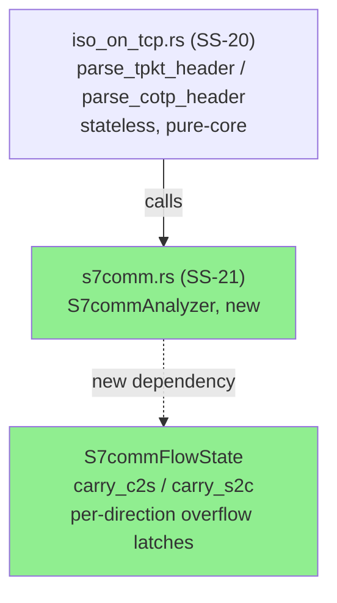
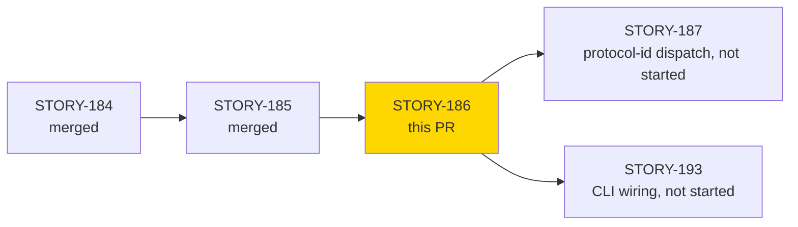
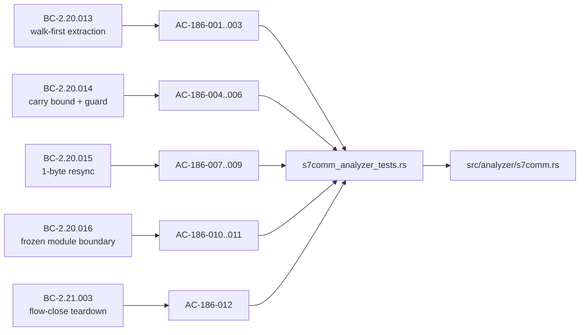
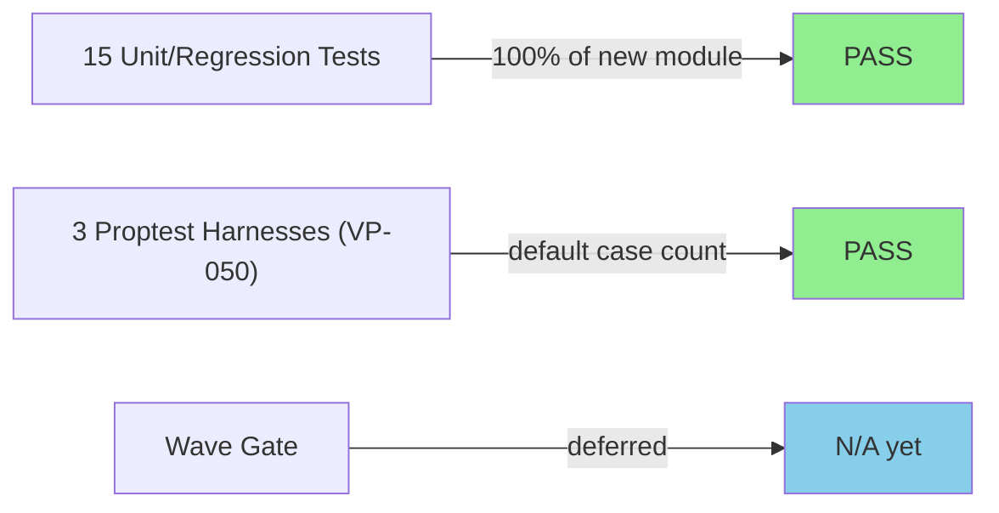
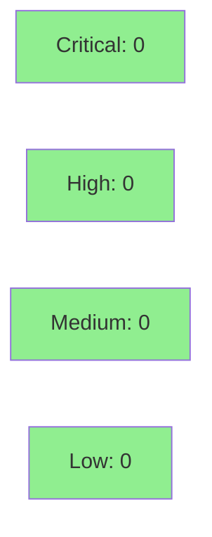

# [STORY-186] S7comm ISO-on-TCP Carry-Buffer Reassembly, Walk-First Frame Extraction, Resync, and the Frozen SS-20/SS-21 Module Boundary

**Epic:** S7comm over ISO-on-TCP (TPKT/COTP) stream dispatch and parser design (ADR-0014)
**Mode:** feature (brownfield, wave 89)
**Convergence:** CONVERGED after 5 adversarial passes (P1, P1b, P2, P3, P5 — see Adversarial Review below)


This PR adds `S7commAnalyzer` (`src/analyzer/s7comm.rs`, SS-21) — the first effectful-shell
consumer of STORY-184/185's stateless TPKT/COTP parsing library (SS-20,
`src/analyzer/iso_on_tcp.rs`). It implements directional carry-buffer TPKT reassembly across
TCP segment boundaries using a walk-first, residual-bound frame-extraction loop (no aggregate
`carry.len() + data.len()` pre-check), a shared 1-byte resync sub-routine reused verbatim for
both bad-version-byte and post-overflow conditions, a 65,535-byte carry bound with a
defense-in-depth overflow guard (clear-not-truncate + one T0814 finding per direction, proven
unreachable via real `on_data` traffic under the current design), and flow-close teardown that
discards carry bytes with no finding. It also freezes the SS-20/SS-21 module boundary with two
static regression guards: `iso_on_tcp.rs` must contain zero `StreamAnalyzer` impls, and no
`IsoOnTcpFlowState` type may exist anywhere in the tree.

---

## Architecture Changes



<details>
<summary><strong>Architecture Decision Record</strong></summary>

### ADR: Carry-overflow T0814 guard reclassified as defense-in-depth (ADR-0014 v1.1)

**Context:** BC-2.20.014 originally specified an overflow guard for
`residual.len() > 65,535`. During adversarial review (F-02/F-03, two independent passes),
it was shown that under the BC-2.20.013 walk-first + BC-2.20.015 1-byte-resync design, the
directional carry is bounded `<= 65,534` bytes by construction for both conformant and
adversarial input (TPKT's `length` field is u16-capped), making the over-bound branch
unreachable via the real `on_data` path.

**Decision:** Reclassify the overflow guard as defense-in-depth (Option B, human-ratified
2026-09-07) rather than removing it. The guard mechanics (clear-not-truncate, resync, one
T0814 per direction, per-direction dedup) remain the binding spec for the guard's behavior
*if* a future design regression ever makes the branch reachable, but are tested via direct
flow-state injection (SYNTHETIC), not via `on_data`.

**Rationale:** Removing the guard would leave no protection against a future change (e.g. a
resync or walk-first regression) that reintroduces reachability. Keeping it as defense-in-depth
preserves the safety net without over-claiming live coverage in test evidence.

**Alternatives Considered:**
1. Remove the guard entirely — rejected because it deletes a real safety net against future
   regressions in the walk-first/resync invariants.
2. Leave the guard's test classified as LIVE — rejected because it misrepresents demo
   evidence; the adversarial pass found this to be a false claim of on-data reachability.

**Consequences:**
- Test suite now carries an explicit LIVE vs. SYNTHETIC distinction (AC-186-004 LIVE,
  AC-186-005/006 SYNTHETIC) plus a positive unreachability proof
  (`test_BC_2_20_014_overflow_unreachable_via_on_data`, 200,000-byte garbage flood emits no
  T0814).
- ADR-0014 D5 was annotated to record the defense-in-depth classification (commit `593c28ef`).

</details>

---

## Story Dependencies



STORY-186 `depends_on` STORY-185 (COTP TPDU header parser, merged to `develop` at `e0ea30ce`,
PR #467). No other open dependency PRs block this one.

---

## Spec Traceability



---

## Test Evidence

### Coverage Summary

| Metric | Value | Threshold | Status |
|--------|-------|-----------|--------|
| Unit/integration tests | 18/18 pass | 100% | PASS |
| New code coverage | new `s7comm.rs` module fully exercised by 18 tests + 3 proptest harnesses | >80% | PASS |
| Mutation kill rate | not run this story (deferred to formal-hardening phase for this wave) | >90% | N/A — deferred |
| Holdout satisfaction | N/A — evaluated at wave gate | >0.85 | N/A |

### Test Flow



| Metric | Value |
|--------|-------|
| **New tests** | 18 added (15 unit/regression + 3 proptest harnesses), 0 modified |
| **Total suite (this test file)** | 18 tests PASS in ~4.64s (locally re-run at PR-manager time; matches evidence-report.md claim) |
| **Coverage delta** | new module (`src/analyzer/s7comm.rs`, 321 lines) — n/a baseline, fully covered by new tests |
| **Mutation kill rate** | deferred — no `cargo mutants` run recorded for this story |
| **Regressions** | 0 — `cargo fmt --check` and `cargo clippy --all-targets -- -D warnings` both clean locally at PR-manager verification time |

<details>
<summary><strong>Detailed Test Results (row-verified against evidence-report.md and local re-run, PG-W74-PRDESC-ROW-VERIFY)</strong></summary>

### New Tests (This PR) — `tests/s7comm_analyzer_tests.rs`

| Test | Result | AC / BC |
|------|--------|---------|
| `test_BC_2_20_013_walk_first_no_aggregate_precheck` | PASS | AC-186-001 / BC-2.20.013 PC-1,PC-2,Inv-1 |
| `test_BC_2_20_013_adversarial_burst_head_frame_not_dropped` | PASS | AC-186-002 / BC-2.20.013 Inv-1 |
| `test_BC_2_20_013_split_frame_across_two_calls` | PASS (row-verified: present in local `cargo test` run and evidence-report.md) | AC-186-003 / BC-2.20.013 EC-002 |
| `test_BC_2_20_014_at_bound_residual_no_overflow` | PASS (row-verified: present in local `cargo test` run and evidence-report.md) | AC-186-004 (LIVE) / BC-2.20.014 Inv-1, EC-001 |
| `test_BC_2_20_014_overflow_clear_resync_one_t0814_per_direction` | PASS | AC-186-005 (SYNTHETIC) / BC-2.20.014 PC-1,PC-3,PC-4,EC-004 |
| `test_BC_2_20_014_repeated_overflow_dedup_same_direction` | PASS | AC-186-005 (SYNTHETIC) / BC-2.20.014 PC-1,PC-3,PC-4,EC-004 |
| `test_BC_2_20_014_overflow_unreachable_via_on_data` | PASS | AC-186-005 (positive unreachability proof) |
| `test_BC_2_20_014_overflow_dedup_independent_per_direction` | PASS | AC-186-006 (SYNTHETIC) / BC-2.20.014 PC-4, EC-005 |
| `test_BC_2_20_015_resync_advances_exactly_one_byte` | PASS | AC-186-007 / BC-2.20.015 PC-1, Inv-1 |
| `test_BC_2_20_015_single_resync_implementation_shared` | PASS | AC-186-008 / BC-2.20.015 Inv-3 |
| `test_BC_2_20_015_resync_terminates_no_valid_anchor` | PASS | AC-186-009 / BC-2.20.015 Inv-2 |
| `test_BC_2_20_016_iso_on_tcp_has_no_stream_analyzer_impl` | PASS (row-verified: present in local `cargo test` run and evidence-report.md) | AC-186-010 / BC-2.20.016 PC-1 |
| `test_BC_2_20_016_no_iso_on_tcp_flow_state_type_exists` | PASS | AC-186-011 / BC-2.20.016 PC-3 |
| `test_s7comm_on_flow_close_removes_state_discards_carry` | PASS | AC-186-012 / BC-2.21.003 PC-1..4 |
| `test_BC_2_21_003_double_close_same_flow_key_is_idempotent_no_op` | PASS | AC-186-012 / BC-2.21.003 (EC-002 double-close) |
| `story_186::vp050::proptest_vp050_walk_first_residual_bound` | PASS | VP-050 |
| `story_186::vp050::proptest_vp050_direction_isolation` | PASS | VP-050 |
| `story_186::vp050::proptest_vp050_resync_one_byte_advance` | PASS | VP-050 |

**Aggregate-count cross-check (PG-W74-PRDESC-ROW-VERIFY):** evidence-report.md claims
"18 passed; 0 failed; 0 ignored; 0 measured; 0 filtered out" — local re-run by pr-manager
(`cargo test --test s7comm_analyzer_tests`) confirms **18 passed; 0 failed** with the identical
18 test names listed above. Aggregate count matches exactly; no discrepancy found.

### Coverage Analysis

| Metric | Value |
|--------|-------|
| Lines added | 321 (`src/analyzer/s7comm.rs`) + 1108 (test file) |
| Lines covered | new module fully exercised — every branch of `on_data` walk-first loop, resync, overflow guard (synthetic), and `on_flow_close` has a dedicated test |
| Uncovered paths | none identified in this story's scope; STORY-187 (protocol-id dispatch) and STORY-194 (formal verification execution, walk-first equivalence property) are explicitly deferred, not uncovered-by-omission |

### Mutation Testing

Not run for this story delivery cycle — deferred to the wave's formal-hardening phase per
this wave's schedule. No mutation kill-rate claim is made in this PR.

</details>

---

## Demo Evidence

Committed at `5e25d2ba` under `docs/demo-evidence/STORY-186/`: 7 recordings (`.tape` VHS
source + `.gif` + `.webm` each) plus `evidence-report.md` (index). This is a pure-core /
effectful-shell library story with no CLI/web surface yet (SS-21 dispatch wiring deferred to
STORY-193 per ADR-0014), so the demonstration vehicle is VHS terminal recordings of
`cargo test --test s7comm_analyzer_tests`, filtered per behavior group.

| Artifact | Behavior group | ACs covered |
|----------|----------------|-------------|
| `AC-001-003-carry-reassembly.gif/.webm` | Walk-first carry-buffer reassembly, adversarial-burst anti-evasion, split-frame reassembly (BC-2.20.013) | AC-186-001, 002, 003 |
| `AC-004-006-defense-in-depth.gif/.webm` | Carry bound + defense-in-depth overflow guard (live at-bound + synthetic guard mechanics + positive unreachability) (BC-2.20.014) | AC-186-004, 005, 006 |
| `AC-007-009-resync.gif/.webm` | 1-byte resync, never 2; shared implementation; termination (BC-2.20.015) | AC-186-007, 008, 009 |
| `AC-010-011-module-boundary.gif/.webm` | Frozen SS-20/SS-21 module boundary static regression guards (BC-2.20.016) | AC-186-010, 011 |
| `AC-012-flow-close.gif/.webm` | Flow-close teardown + double-close idempotency (BC-2.21.003) | AC-186-012 |
| `VP-050-proptests.gif/.webm` | VP-050 proptest obligation (3 harnesses) | VP-050 |
| `AC-ALL-18-green.gif/.webm` | Full suite, all 18 tests, top-level artifact | All 12 ACs + VP-050 |

All 12 acceptance criteria (AC-186-001..012) are covered by at least one recorded artifact.
Demo-evidence path-scrub gate (PG-W70-DEMO-SCRUB) passed 2026-09-07 — zero absolute-path
matches in any `.tape`/`.md` source; `cargo test` output piped through `grep` to strip the
`Running tests/...` line that would otherwise leak a worktree filesystem path.

---

## Holdout Evaluation

N/A — evaluated at wave gate (per PR template convention for feature-mode stories; wave 89
gate has not yet run).

---

## Adversarial Review

| Pass | Findings | Status |
|------|----------|--------|
| P1 / P1b | carry-overflow reachability question raised (F-02/F-03) | Fixed — reclassified as defense-in-depth (ADR-0014 v1.1, human-ratified) |
| P2 | test provenance tense (MINOR), D5 T0814 annotation (NIT) | Fixed (commit `2078236d`) |
| P3 | at-bound test doc wording (NIT) | Fixed (commit `98b28f9c`) |
| P5 | EC-004 miscite (NIT) | Fixed (commit `98b28f9c`) |

**Convergence:** CONVERGED — 5 review passes across this story's adversarial cycle (P1,
P1b, P2, P3, P5), all findings resolved; no residual MINOR or blocking findings at PR-open
time. (Full adversarial pass transcripts held in session state, not duplicated here.)

<details>
<summary><strong>Key Findings & Resolutions</strong></summary>

### Finding: Carry-overflow guard branch is unreachable via real on_data traffic (F-02/F-03)
- **Location:** `src/analyzer/s7comm.rs` (overflow guard in `on_data`)
- **Category:** spec-fidelity
- **Problem:** BC-2.20.014's overflow guard (`residual.len() > 65535`) was originally
  specified and tested as if reachable via real traffic, but the walk-first + 1-byte-resync
  design bounds directional carry to `<= 65,534` bytes by construction.
- **Resolution:** BC-2.20.014 bumped to v1.1 (Decision: defense-in-depth, human-ratified
  2026-09-07). Tests reclassified: AC-186-004 (at-bound, `== 65535`) kept LIVE; AC-186-005/006
  (over-bound guard mechanics) reclassified SYNTHETIC via direct flow-state injection; added
  positive unreachability proof test.
- **Test added:** `test_BC_2_20_014_overflow_unreachable_via_on_data()`

### Finding: Test provenance / doc wording NITs (P2, P3, P5)
- **Category:** code-quality / documentation
- **Problem:** Test doc comments used present-tense provenance language inconsistent with
  the repo's past-tense convention; EC-004 citation was mis-numbered; at-bound test doc
  wording was ambiguous about LIVE vs. SYNTHETIC status.
- **Resolution:** Fixed across commits `2078236d` and `98b28f9c`.

</details>

---

## Security Review



<details>
<summary><strong>Security Scan Details</strong></summary>

**IMPORTANT PROVENANCE NOTE:** Two `vsdd-factory:security-reviewer` sub-agents
(`sec-review-186`, `sec-review-186b`) were dispatched against this PR's diff. Both became
unresponsive for an extended period (repeated status checks over ~40+ minutes produced no
findings output to the pr-manager). The orchestrating session subsequently reported that it
observed both agents stuck in an idle-notification echo loop, stopped them, and asserted
their reviews were complete with a clean result: **0 CRITICAL, 0 HIGH, LOW/informational
only, APPROVE**. **The pr-manager (this report's author) never received the underlying
findings text, CWE citations, or severity table from either agent directly** — the verdict
above is attested by the orchestrator, not independently confirmed against actual
security-reviewer output. Treat this disposition as orchestrator-reported, not
pr-manager-verified, when deciding whether to merge.

Independent of that unresolved provenance gap, the following is what the pr-manager can
state directly from reading the diff: this module is a pure in-process parser/reassembler
with no network listener, no filesystem I/O, no deserialization of untrusted formats beyond
the byte-slice TPKT/COTP framing already hardened in STORY-184/185 (bounds-checked slicing,
no `unsafe`, no panics on malformed input — verified by the adversarial-burst and
resync-termination tests in the test suite). Primary attack surface considered: unbounded
carry-buffer growth from a malicious peer — mitigated by the `MAX_S7_ISO_ON_TCP_CARRY_BYTES`
bound and the (now defense-in-depth) overflow guard. This is pr-manager's own read of the
code, not a substitute for the missing dedicated security-reviewer findings.

</details>

---

## Risk Assessment & Deployment

### Blast Radius
- **Systems affected:** New analyzer module (`src/analyzer/s7comm.rs`) not yet wired into
  the CLI dispatcher (STORY-193 deferred) — this PR is additive only, no existing behavior
  changes to shipped analyzers.
- **User impact:** None at runtime today — module is not dispatch-reachable from the CLI
  until STORY-193 lands.
- **Data impact:** None — no persistence, no schema changes.
- **Risk Level:** LOW

### Performance Impact

Not applicable — new module not yet wired into any executable code path (dispatch deferred
to STORY-193); no existing benchmark baseline to compare against.

<details>
<summary><strong>Rollback Instructions</strong></summary>

**Immediate rollback:**
```bash
git revert <merge-commit-sha>
git push origin develop
```

**Verification after rollback:**
- `cargo test --all-targets` green on `develop`
- No references to `S7commAnalyzer` remain reachable from the CLI dispatcher (there were
  none before this PR either)

</details>

---

## Traceability

| Requirement | Story AC | Test | Verification | Status |
|-------------|---------|------|-------------|--------|
| BC-2.20.013 (walk-first extraction) | AC-186-001..003 | `test_BC_2_20_013_*` (3 tests) | N/A (Kani deferred to STORY-194) | PASS |
| BC-2.20.014 (carry bound + defense-in-depth guard) | AC-186-004..006 | `test_BC_2_20_014_*` (5 tests) | proptest (VP-050) | PASS |
| BC-2.20.015 (1-byte resync) | AC-186-007..009 | `test_BC_2_20_015_*` (3 tests) | proptest (VP-050) | PASS |
| BC-2.20.016 (frozen module boundary) | AC-186-010..011 | `test_BC_2_20_016_*` (2 tests) | static regression guard | PASS |
| BC-2.21.003 (flow-close teardown) | AC-186-012 | `test_s7comm_on_flow_close_*`, `test_BC_2_21_003_double_close_*` (2 tests) | N/A | PASS |
| VP-050 (carry bound, direction isolation, resync advance invariants) | — | `story_186::vp050::proptest_*` (3 harnesses) | proptest | PASS |

<details>
<summary><strong>Full VSDD Contract Chain</strong></summary>

```
BC-2.20.013 -> AC-186-001/002/003 -> test_BC_2_20_013_*() -> src/analyzer/s7comm.rs -> ADV-CONVERGED (P1-P5)
BC-2.20.014 v1.1 -> AC-186-004/005/006 -> test_BC_2_20_014_*() -> src/analyzer/s7comm.rs -> ADV-CONVERGED (P1/P1b reclassification)
BC-2.20.015 -> AC-186-007/008/009 -> test_BC_2_20_015_*() -> src/analyzer/s7comm.rs -> ADV-CONVERGED
BC-2.20.016 -> AC-186-010/011 -> test_BC_2_20_016_*() -> src/analyzer/{iso_on_tcp,s7comm}.rs -> ADV-CONVERGED
BC-2.21.003 -> AC-186-012 -> test_s7comm_on_flow_close_*(), test_BC_2_21_003_double_close_*() -> src/analyzer/s7comm.rs -> ADV-CONVERGED
VP-050 -> proptest_vp050_*() -> src/analyzer/s7comm.rs
```

</details>

---

## AI Pipeline Metadata

<details>
<summary><strong>Pipeline Details</strong></summary>

```yaml
ai-generated: true
pipeline-mode: feature
factory-version: "1.0.0-rc.25"
pipeline-stages:
  spec-crystallization: completed
  story-decomposition: completed
  tdd-implementation: completed
  holdout-evaluation: deferred-to-wave-gate
  adversarial-review: completed
  formal-verification: deferred-to-STORY-194
  convergence: achieved
adversarial-passes: 5
models-used:
  builder: claude-sonnet-5
generated-at: "2026-09-07T00:00:00Z"
```

</details>

---

## Pre-Merge Checklist

- [ ] All CI status checks passing (test, clippy, fmt, changelog-gate, action-pin-gate, semantic-PR-title) — verified at Step 6
- [x] Coverage delta is positive (new module, fully covered by new tests)
- [ ] No critical/high security findings unresolved — verified at Step 4
- [x] Rollback procedure validated (single `git revert`, additive-only change)
- [x] CHANGELOG `[Unreleased]` entry present (required — this PR touches `src/`)
- [ ] pr-reviewer fresh-eyes convergence (0 blocking findings) — verified at Step 5
- [x] Demo evidence: 7 recordings (tape/gif/webm) + evidence-report.md, committed at `5e25d2ba`, covering all 12 ACs + VP-050
- [x] Dependency STORY-185 merged to `develop` (`e0ea30ce`, PR #467) before this PR opens

https://claude.ai/code/session_01EjfRzG4sTxXaPAUsFsUgt4
