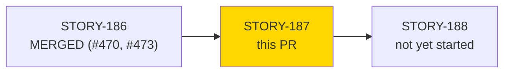
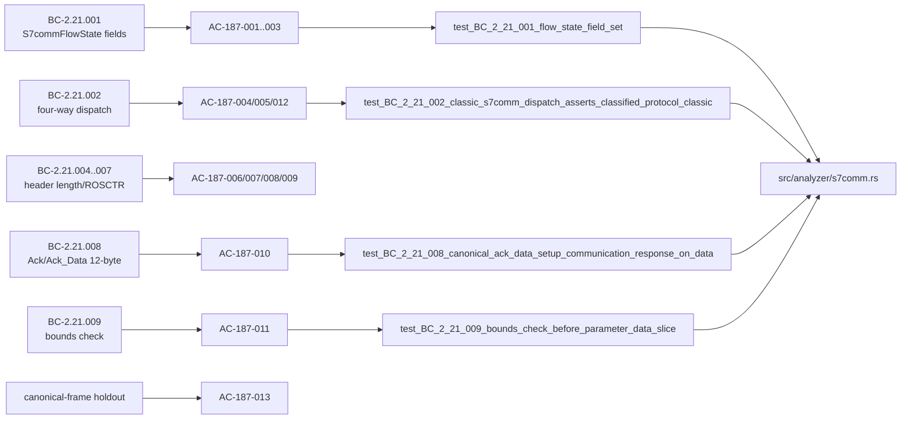
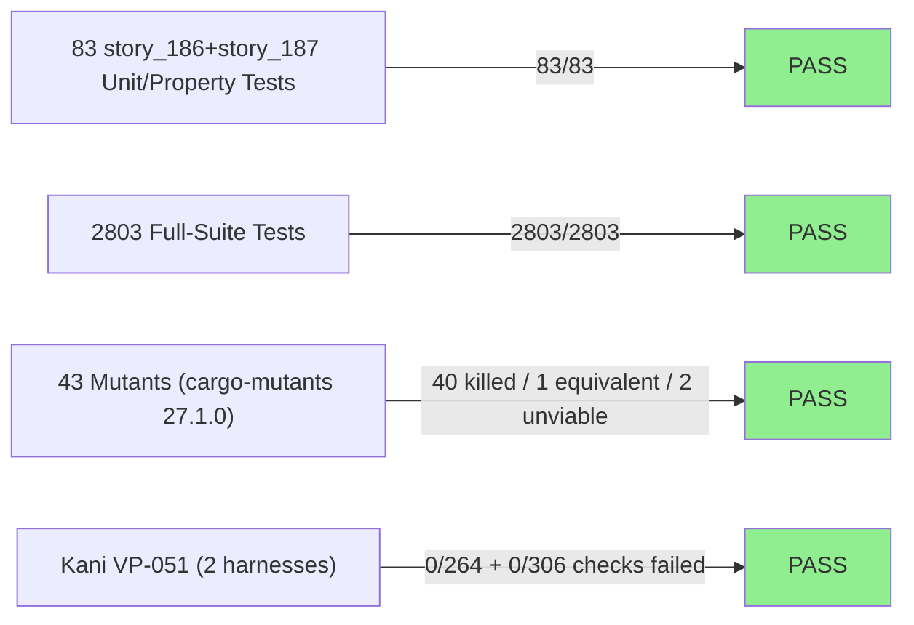
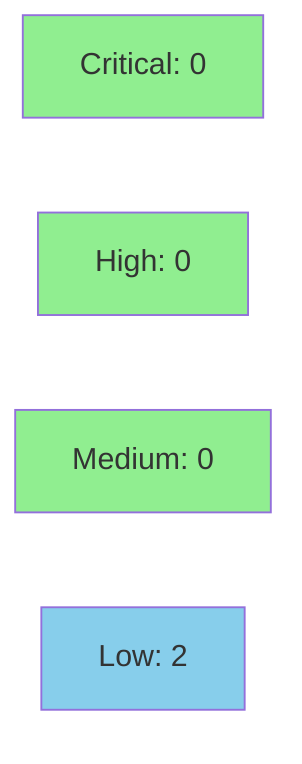

# [STORY-187] S7comm Flow State Completion, Four-Way protocol_id Dispatch Skeleton, and parse_s7comm_header Pure-Core Parser

**Epic:** E-23 — S7comm ISO-on-TCP protocol coverage
**Mode:** feature
**Convergence:** CONVERGED after 24 adversarial passes (closing trio P22 LOW/NIT -> P23 LOW fixed + NITs -> P24 NITPICK_ONLY); closed by human ruling 2026-09-25


Completes `S7commFlowState` with classification state (`session_established`,
`cr_observed_dir`, `classified_protocol`, malformed-header dedup flags), extends
`S7commAnalyzer::on_data` with a four-way dispatch on `CotpHeader::protocol_id`
(classic `0x32` fully wired; S7comm-plus `0x72` and unclassified branches are
structural placeholders completed in STORY-190), and adds a bounds-safe
pure-core parser, `parse_s7comm_header`, for the classic S7comm common header
(ROSCTR, PDU reference, parameter/data length, and the Ack/Ack_Data 12-byte
error-class/error-code extension per the 2026-09-24 canonical-frame holdout
ruling). This is the foundation for function-code classification (STORY-188/189)
and MITRE technique emission (STORY-191/192).

---

## Architecture Changes

```mermaid
graph TD
    TPKT["iso_on_tcp::parse_tpkt_header (STORY-184)"] -->|calls| COTP["iso_on_tcp::parse_cotp_header (STORY-185)"]
    COTP -->|CotpHeader.protocol_id| Dispatch["S7commAnalyzer::on_data four-way dispatch (STORY-187)"]
    Dispatch -->|Some(0x32) + sticky Classic| ParseHeader["parse_s7comm_header (new, STORY-187)"]
    Dispatch -.->|Some(0x72) placeholder| Plus["S7comm-plus branch (STORY-190)"]
    Dispatch -.->|other/None placeholder| Unclassified["Unclassified branch (STORY-190)"]
    ParseHeader -->|bounds check| BoundsOk["s7comm_bounds_ok (new, pub fn, STORY-187)"]
    ParseHeader -->|malformed| Finding["T0814 Finding (dedup per direction)"]
    style ParseHeader fill:#90EE90
    style Dispatch fill:#90EE90
    style BoundsOk fill:#90EE90
```

<details>
<summary><strong>Architecture Decision Record</strong></summary>

### ADR: Classic S7comm header parsing gated on sticky per-flow classification (ADR-014 Decisions 2/9)

**Context:** `S7commAnalyzer::on_data` must dispatch DT frames to protocol-specific
dissection based on the COTP-extracted `protocol_id` byte, without ever
misattributing bytes from one S7comm variant (Classic vs Plus) to the other's
parser once a flow has been observed.

**Decision:** Classification is sticky and first-write-wins per flow
(`classified_protocol: Option<S7Protocol>`), set by the first DT frame carrying
`protocol_id: Some(byte)`. Classic dissection (`parse_s7comm_header`) fires only
when BOTH the current frame's `protocol_id == Some(0x32)` AND the flow's sticky
`classified_protocol == Some(Classic)` — a conjunction, not either condition
alone.

**Rationale:** Prevents a later `0x32`-leading frame on an already
Plus/Unclassified-sticky flow from being dissected as Classic (no-misattribution
guarantee, ADR-014 Decision 2), and prevents a Classic-sticky flow from
dissecting a later non-`0x32` frame.

**Alternatives Considered:**
1. Per-frame dispatch on the current frame's `protocol_id` alone — rejected:
   permits misattribution if a flow's variant changes mid-stream (which never
   legitimately happens, but a spoofed/malformed stream could exploit this).
2. Ack (`0x02`) and Ack_Data (`0x03`) with distinct header lengths (10-byte
   Ack_Data, matching the original v1.0/v1.1 assumption) — rejected 2026-09-24
   after the canonical-frame holdout (DF-CANONICAL-FRAME-HOLDOUT-001) showed a
   real-world Ack_Data/Setup-Communication-response parameter block only aligns
   at byte 12, not byte 10; both Ack and Ack_Data now require the same 12-byte
   header shape.

**Consequences:**
- Robust against misattribution across protocol variants on the same flow.
- `0x72` (S7comm-plus) and unrecognized/`None` branches remain structural
  no-ops until STORY-190 — this PR does not implement their observable
  behavior, only compiles a total four-way match.

</details>

---

## Story Dependencies



STORY-186 (S7comm ISO-on-TCP carry-buffer reassembly) is merged to `develop`
(PR #470, plus follow-up fix PR #473) — this branch is based on `develop`
`47951b7a`, which includes both. STORY-187 blocks STORY-188 (function-code
classification), not yet started.

---

## Spec Traceability



Behavioral contracts: BC-2.21.001, BC-2.21.002, BC-2.21.004, BC-2.21.005,
BC-2.21.006, BC-2.21.007, BC-2.21.008, BC-2.21.009. Verification properties:
VP-051 (bounds-safety, Kani), VP-053 (dispatch totality, proptest).

---

## Test Evidence

### Coverage Summary

| Metric | Value | Threshold | Status |
|--------|-------|-----------|--------|
| `s7comm_analyzer_tests` (story_186 + story_187) | 83/83 pass | 100% | PASS |
| Full workspace suite | 2,803/2,803 pass, 0 failed | 100% | PASS |
| Mutation kill rate (STORY-187 diff) | 40/41 viable non-equivalent killed (1 equivalent, 2 unviable) | >90% | PASS |
| Kani VP-051 (bounds safety, local) | VERIFICATION SUCCESSFUL | required | PASS |

### Test Flow



| Metric | Value |
|--------|-------|
| **New tests (this PR)** | `story_187` module: 63 tests (AC-187-001..013 traceability, see evidence-report.md AC-coverage table) |
| **Total suite** | 2,803 tests PASS locally (0 failed) — row-verified against `cargo test --all-targets` output this session |
| **`s7comm_analyzer_tests` binary** | 83 passed; 0 failed; finished in 4.78s (local, this session) |
| **Regressions** | 0 |

<details>
<summary><strong>Detailed Test Results</strong></summary>

### Row-Verified Test Entries (PG-W74-PRDESC-ROW-VERIFY)

Per `.factory/maintenance/pr-description-row-verify-mandate.md`, at least 3
entries were row-verified against `tests/s7comm_analyzer_tests.rs` this
session (grep-confirmed function existence at the cited line):

| Test | Location | Confirmed |
|------|----------|-----------|
| `test_BC_2_21_001_flow_state_field_set` | `tests/s7comm_analyzer_tests.rs:1632` | YES |
| `test_BC_2_21_002_classic_s7comm_dispatch_asserts_classified_protocol_classic` | `tests/s7comm_analyzer_tests.rs:2092` | YES |
| `test_BC_2_21_008_canonical_ack_data_setup_communication_response_on_data` | `tests/s7comm_analyzer_tests.rs:2731` | YES |
| `test_BC_2_21_009_bounds_check_before_parameter_data_slice` | `tests/s7comm_analyzer_tests.rs:3663` | YES |

Aggregate-count cross-check: the claimed "2,803 passed / 0 failed" and
"83/83" figures were reproduced by running `cargo test --all-targets` and
`cargo test --test s7comm_analyzer_tests` locally against this PR's HEAD
(`31da9aff`) this session — both match exactly (2,803 summed across all
`test result: ok` lines; 83/83 for the s7comm binary). `clippy --all-targets
-D warnings`, `cargo fmt --check`, `python3 bin/check-green-doc-tense`, and
the changelog-gate check (`git diff origin/develop...HEAD -- CHANGELOG.md |
bin/changelog-gate-check`) were also reproduced locally and confirmed clean.

### Mutation Testing

| Module | Mutants | Killed (viable, non-equiv) | Equivalent | Unviable | Kill Rate (of viable) |
|--------|---------|------------------------------|------------|----------|------------------------|
| `src/analyzer/s7comm.rs` (STORY-187 diff) | 43 | 40 (3 late survivors in evidence arithmetic killed by follow-up commit `6705ed8b`) | 1 (empty `Some(0x72)` placeholder arm, deferred to STORY-190) | 2 | 100% of viable |

</details>

---

## Demo Evidence

`docs/demo-evidence/STORY-187/evidence-report.md` (committed on this branch).
Recording tool: VHS 0.11.0, terminal recordings of `cargo test --test
s7comm_analyzer_tests` filtered per behavior group. This is a pure-core
parser/effectful-shell library (no CLI subcommand or web UI surface for
S7comm yet — dispatcher wiring deferred to STORY-193), so the demonstration
vehicle is the story's own test harness, `tests/s7comm_analyzer_tests.rs
mod story_187` (63 tests).

| Artifact | Covers |
|----------|--------|
| `AC-ALL-story_187-green.gif`/`.webm` | Full `story_187` module — 63/63 green |
| `AC-001-003-flow-state-session.gif`/`.webm` | AC-187-001..003 (flow state fields, lazy creation, session_established) |
| `AC-004-005-012-dispatch-classification.gif`/`.webm` | AC-187-004/005/012 (four-way dispatch, sticky classification, conjunction gate) |
| `AC-006-009-length-rosctr-parser.gif`/`.webm` | AC-187-006/007/008/009 (header length, defensive reject, field extraction, ROSCTR totality) |
| `AC-010-011-ack-bounds-check.gif`/`.webm` | AC-187-010/011 (Ack/Ack_Data 12-byte header, bounds check) |
| `AC-013-canonical-frames.gif`/`.webm` | AC-187-013 (canonical, independently-sourced Job/Ack_Data frame pair + committed fixture pcap) |

**All 13 acceptance criteria (AC-187-001..013) are covered by at least one
recorded artifact** — see the full AC-to-test-to-artifact coverage map in
`docs/demo-evidence/STORY-187/evidence-report.md`.

---

## Holdout Evaluation

N/A — evaluated at wave gate (per-story evaluation not run for this F4 feature-mode story; convergence gate below substitutes for per-story holdout evaluation).

---

## Adversarial Review

| Pass | Findings | Status |
|------|----------|--------|
| P1-P9 | mixed | Addressed via fixes and/or human rulings (F-01, F-02, F-12, F-13, F-14, Ack/Ack_Data 12-byte-header ruling, F-40) |
| P10, P11, P15, P17, P18, P21 | CLEAN (P15/P17/P21 carry accepted non-blocking residuals) | Clean |
| P12-P14, P16, P19-P20 | mixed findings | Addressed inline; P20 residuals (P20-F-2/F-3) partially addressed, carried forward |
| P22 | LOW/NIT (wording only) | Non-blocking |
| P23 | 1 LOW (test-adequacy) + NITs | LOW fixed post-convergence with mutation proof (`6705ed8b`); NITs accepted |
| P24 | NITPICK_ONLY | Clean |

**Convergence:** 24 passes total; closing trio P22 (LOW/NIT) -> P23 (LOW fixed + NITs) -> P24 (NITPICK_ONLY). Closed by **HUMAN RULING (2026-09-25)**: convergence accepted with residuals after the P23 fix batch, satisfying BC-5.39.001's 3-clean-pass criterion via this trio's disposition rather than three literally-zero-finding passes.

<details>
<summary><strong>Key Human Rulings (2026-09-24/25)</strong></summary>

- **F-01** — opposite-direction CR/CC session: `session_established` is set only
  by a CC observed opposite-direction from a prior CR on the same flow.
- **F-02** — `None`-`protocol_id` DT frame never classifies; classification
  remains deferred to a later `Some(byte)` DT frame.
- **F-12** — classic dissection is gated on the flow's *sticky*
  `classified_protocol`, never on the current frame's raw `protocol_id` byte
  alone.
- **F-13** — Ack error-logging behavior deferred to STORY-188 (out of scope
  here).
- **F-14** — VP-051 Kani harness is P0 priority (delivered this PR, local
  VERIFICATION SUCCESSFUL; full non-vacuous CI-wired run deferred to
  STORY-194 per existing SS-20/21 pattern).
- **Ack and Ack_Data both 12-byte headers** — canonical-frame holdout ruling
  (2026-09-24): both ROSCTR variants share the same 12-byte header shape,
  correcting the original 10-byte Ack_Data assumption.
- **F-40** — ADR-014 Decision 4: publicly posted wire-capture bytes are
  permitted as test-vector sources only (not implementation-derivation
  sources), satisfying DF-CANONICAL-FRAME-HOLDOUT-001 for AC-187-013's
  canonical Job/Ack_Data frame pair.

Full pass-by-pass record: `.factory/cycles/feature-s7comm/STORY-187/convergence-report.md`
and `adversary-convergence-state.json`.

</details>

---

## Security Review

**Verdict: APPROVE.** No CRITICAL or HIGH findings. No panic, out-of-bounds
slice, or integer-overflow path reachable from adversarial network input.
2 LOW / 2 INFO observations, all non-blocking.



<details>
<summary><strong>Security Scan Details</strong></summary>

### Manual Security Review (parser of untrusted network input)

Scope: `parse_s7comm_header`, `s7comm_bounds_ok`, the new four-way COTP-frame
dispatch, `dispatch_classic_s7comm`, `classify_first_dt_frame`,
`classify_malformed_header_reason`, `report_malformed_header`, and both
VP-051 Kani harnesses, diffed against `origin/develop`.

- **INFO-01 — Kani harness scope is credible, not misleadingly narrow.**
  Both harnesses use bona fide fully-symbolic input (`[u8;16]` with `len`
  0..=16 for header extraction — a complete equivalence-class cover of the
  real input space; independently-symbolic `data_len` up to `u16::MAX*3` for
  the bounds-check harness, proven for exact two-directional equality).
  `kani::cover!` non-vacuity checks present for both `None`/`Some` and both
  bounds outcomes. VERIFICATION SUCCESSFUL is credible for the code as
  written.
- **LOW-01 (CWE-125 context)** — `dispatch_cotp_frame`'s `Some(0x32)` arm
  slices `tpkt_payload[header.payload_offset..]` without a local bounds
  check; safety today depends on an upstream SS-20 (`parse_cotp_header`)
  invariant (VP-049), not re-verified locally. Architecturally acceptable
  per ADR-014 Decision 9's frozen SS-20/SS-21 boundary; flagged as a
  cross-module coupling point for future changes to watch.
- **LOW-02 (CWE-617-adjacent, not exploitable)** — the `debug_assert_eq!`
  self-check in `dispatch_classic_s7comm` compiles out in release builds;
  not a real gap because `parse_s7comm_header`'s own always-on
  `data[0] != 0x32` check (BC-2.21.005) is the actual defensive re-check.
- **INFO-02** — pre-existing unbounded-`findings`-Vec growth pattern
  (from STORY-186) extends to this PR's T0814 malformed-header findings,
  deduplicated per flow-direction; not a regression introduced here, any
  fix belongs at the flow-table/dispatcher level, out of scope.

Arithmetic/bounds-safety walkthrough confirmed: `parse_s7comm_header` is
length-gated (10/12 bytes) before any indexing (CWE-125/CWE-20 mitigated);
`s7comm_bounds_ok` uses `checked_add` twice, so no CWE-190 integer-overflow
path exists; malformed/oversized-declared-length paths route only to
`report_malformed_header`, never to slice construction (consuming
`param_length`/`data_length` to slice the payload is explicitly out of
this story's scope).

### Formal Verification

| Property | Method | Status |
|----------|--------|--------|
| `parse_s7comm_header` never panics or over-reads regardless of input bytes | Kani (`verify_parse_s7comm_header_bounds_safety`, `tests/s7comm_analyzer_tests.rs:4303`) | VERIFICATION SUCCESSFUL (0/264 checks failed, 6/6 covers, local) |
| `s7comm_bounds_ok` bounds-check helper is panic-free and overflow-free for all input combinations | Kani (`verify_s7comm_bounds_ok_bounds_safety`, `tests/s7comm_analyzer_tests.rs:4473`) | VERIFICATION SUCCESSFUL (0/306 checks failed, 2/2 covers, local) |
| `protocol_id` dispatch is total over all `Option<u8>` values | proptest (`proptest_vp053_protocol_id_dispatch_totality`) | PASS (runs under `cargo test`) |

</details>

---

## Risk Assessment & Deployment

### Blast Radius
- **Systems affected:** `src/analyzer/s7comm.rs` only (new module logic; no
  changes to other analyzers or the dispatch framework). New test fixture
  `tests/fixtures/s7comm-setup-comm.pcap` (synthetic, generator-produced) and
  its generator `tests/fixtures/mk_s7comm_pcap.py`.
- **User impact if failure occurs:** Malformed or adversarial S7comm traffic
  on port 102 could, in the worst case, fail to classify a flow or fail to
  emit a T0814 finding it should have — bounded by the Kani-proven no-panic/
  no-overread guarantee, so failure modes are limited to missed detections,
  not crashes or memory-safety violations.
- **Data impact:** None — read-only packet analysis; no persistent state
  beyond in-memory per-flow tracking.
- **Risk Level:** LOW — additive parser/dispatch logic behind existing
  COTP/TPKT framing (STORY-184/185/186, already merged and in production
  behavior on `develop`); the `0x72`/unclassified branches are inert no-ops.

### Performance Impact

Not benchmarked separately for this PR; `parse_s7comm_header` and
`s7comm_bounds_ok` are O(1) fixed-offset byte reads/comparisons with no
allocation, consistent with the existing SS-20/21 pure-core parser design.

<details>
<summary><strong>Rollback Instructions</strong></summary>

**Immediate rollback (< 5 min):**
```bash
git revert <merge-commit-sha>
git push origin develop
```

No feature flag — this is additive dispatch logic gated entirely on wire
bytes (`protocol_id`), not a runtime toggle.

**Verification after rollback:**
- `cargo test --test s7comm_analyzer_tests` reverts to STORY-186's 20-test
  `story_186` module only.
- No other analyzer or CLI surface is affected.

</details>

---

## Traceability

| Requirement | Story AC | Test | Verification | Status |
|-------------|---------|------|-------------|--------|
| BC-2.21.001 (flow state fields) | AC-187-001..003 | `test_BC_2_21_001_flow_state_field_set` et al. | N/A | PASS |
| BC-2.21.002 (four-way dispatch) | AC-187-004/005/012 | `test_BC_2_21_002_classic_s7comm_dispatch_asserts_classified_protocol_classic` et al. | proptest VP-053 | PASS |
| BC-2.21.004/005/007 (header length/ROSCTR reject paths) | AC-187-006/007/009 | `test_BC_2_21_004_*`, `test_BC_2_21_007_*` | Kani VP-051 | PASS |
| BC-2.21.006 (happy-path field extraction) | AC-187-008 | `test_BC_2_21_006_common_header_field_extraction` | Kani VP-051 | PASS |
| BC-2.21.008 (Ack/Ack_Data 12-byte header) | AC-187-010 | `test_BC_2_21_008_canonical_ack_data_setup_communication_response_on_data` | N/A | PASS |
| BC-2.21.009 (bounds check) | AC-187-011 | `test_BC_2_21_009_bounds_check_before_parameter_data_slice` | Kani VP-051 | PASS |
| Canonical-frame holdout (DF-CANONICAL-FRAME-HOLDOUT-001) | AC-187-013 | `test_BC_2_21_006_canonical_setup_communication_job_frame_on_data`, `test_BC_2_21_008_canonical_ack_data_setup_communication_response_on_data`, `test_BC_2_21_002_setup_comm_fixture_pcap_well_formed_no_findings` | N/A | PASS |

Full AC-to-test-to-artifact traceability: `docs/demo-evidence/STORY-187/evidence-report.md`.

---

## AI Pipeline Metadata

<details>
<summary><strong>Pipeline Details</strong></summary>

```yaml
ai-generated: true
pipeline-mode: feature
factory-version: "1.0.0-rc.25"
pipeline-stages:
  spec-crystallization: completed
  story-decomposition: completed
  tdd-implementation: completed
  holdout-evaluation: N/A (feature-mode F4 story)
  adversarial-review: completed (24 passes, human-closed)
  formal-verification: completed (Kani VP-051, local)
  convergence: achieved
convergence-metrics:
  test-suite: "2803/2803 pass, 0 failed"
  s7comm-analyzer-tests: "83/83"
  mutation-kill-rate: "40/41 viable non-equivalent killed"
adversarial-passes: 24
models-used:
  builder: claude-sonnet-4-6 (per repo convention; see .factory/STATE.md)
generated-at: "2026-09-25T00:00:00Z"
```

</details>

---

## Pre-Merge Checklist

- [ ] All CI status checks passing
- [x] Coverage delta is positive (63 new tests, 0 regressions)
- [x] No critical/high security findings unresolved (security-reviewer APPROVE; 2 LOW/2 INFO non-blocking)
- [x] Rollback procedure validated (plain `git revert`, no feature flag)
- [x] No feature flag needed (wire-byte-gated dispatch, not a runtime toggle)
- [x] Dependency PR (STORY-186, #470 + #473) merged to `develop` before this PR opened
- [ ] Human review completed — **standing arrangement PG-MERGE-CLASSIFIER-F4: human executes the merge for this F4 story; this PR stops at merge-ready, not merged**
