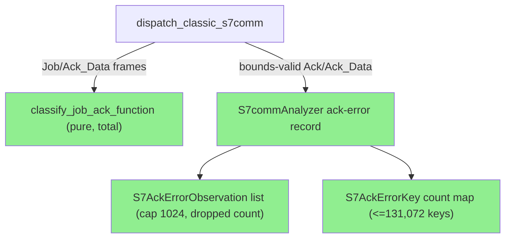
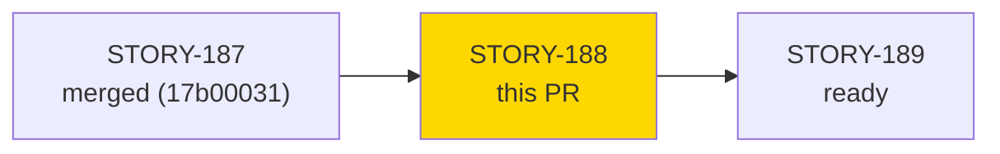
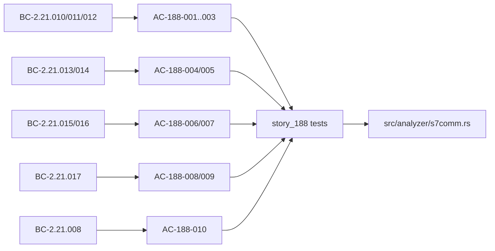

# [STORY-188] S7comm Job/Ack_Data Function-Code Classification

**Epic:** E-23 — S7comm analyzer (wave 91)
**Mode:** feature
**Convergence:** CONVERGED after 7 per-story adversarial passes (BC-5.39.001; closing trio P5 NITPICK_ONLY / P6 CLEAN / P7 NITPICK_ONLY)


Adds a pure, total classifier `classify_job_ack_function` over the classic S7comm Job/Ack_Data parameter-block function-code byte (Setup Communication, Read Var, Write Var with first-item area code, Download and Upload triads, PLC Control with byte-exact PI-service decode, PLC Stop, `Unrecognized(fc)`, `NoParameterBlock`), wires it into the `S7commAnalyzer` classic dispatch as a classification-only placeholder (consumed by STORY-191/192), and records bounds-valid Ack/Ack_Data `error_class`/`error_code` pairs in an analyzer-side bounded record plus an exact count map. No Finding and no stderr/log output is produced. Closes PRF-005 via the registered VP-051 Kani harness.

---

## Architecture Changes



Single module touched (`src/analyzer/s7comm.rs`, SS-21). ADR-0014 (S7comm over ISO-on-TCP) governs; ADR-0004 flooding rationale drives the no-stderr ruling R1.

## Story Dependencies



## Spec Traceability



---

## Test Evidence

Full suite at PR HEAD (local `cargo test --all-targets`, re-run by pr-manager): **2837 passed; 0 failed** across all targets. `tests/s7comm_analyzer_tests.rs`: 117 passed (83 pre-existing `story_186`/`story_187` + 34 new `story_188`). Counts cross-checked against the CI run output in step 6 (see PR comment).

| Metric | Value |
|--------|-------|
| New tests | 34 `story_188::` tests (incl. 6 `canonical::`, proptests VP-052/VP-054, exhaustive-u8 area test) + 1 Kani harness (VP-051) + 1 committed pcap fixture e2e |
| Total suite | 2837 PASS, 0 failed |
| Regressions | 0 |

<details>
<summary><strong>Per-test rows (row-verified against `tests/s7comm_analyzer_tests.rs` at PR HEAD)</strong></summary>

| Test | Location | Result |
|------|----------|--------|
| `test_BC_2_21_012_write_var_descriptor_length_boundary_11_12_13_14` | line 6189 | PASS |
| `vp054::proptest_vp054_download_upload_structural_disjointness` | line 5865 | PASS |
| `test_BC_2_21_008_ack_error_histogram_counts_beyond_list_cap` | line 6291 | PASS |
| `test_BC_2_21_008_job_frames_record_no_ack_error_observation` | line 5976 | PASS |
| `canonical::test_BC_2_21_016_canonical_plc_stop_classified` | line 6515 | PASS |
| `vp051_kani::verify_classify_job_ack_function_param_slicing_safe` (Kani) | line 6539 | VERIFICATION SUCCESSFUL |

</details>

Demo evidence: `docs/demo-evidence/STORY-188/evidence-report.md` (11/11 ACs mapped to recordings; path-scrub gate re-run, zero matches).

---

## Human Rulings and Carry-Forwards

- **R1 (2026-10-04):** AC-188-010 / BC-2.21.008 PC4 surface is an analyzer-side bounded record (cap `MAX_S7_ACK_ERROR_OBSERVATIONS` = 1024, saturating dropped count), NOT stderr (ADR-0004 flooding rationale).
- **R2 (2026-10-04):** exact per-(ROSCTR, error_class, error_code) count map (`S7AckErrorKey`, <= 131,072 keys) plus `pdu_reference` on each observation.
- **PRF-005:** closed by this PR (VP-051 Kani harness registered and passing).
- **STORY-191-192-DECODER-LENIENCY:** logged as a carry-forward (not addressed here).

## BREAKING-Change Statement (PG-W72-BREAKING-HOLDOUT-SWEEP)

Not in scope. This story adds **no output-format change** (no JSON schema, field, enum, or text-layout change; no Finding emitted) and **no breaking API removal** (public API is additive only: `classify_job_ack_function`, `S7ClassicFunction`, `S7AreaCode`, `PlcControlService`, `S7AckErrorKey`, `S7AckErrorObservation`, `MAX_S7_ACK_ERROR_OBSERVATIONS`, and three accessors). No holdout-expectation sweep required.

## CHANGELOG

`[Unreleased]` entry present (changelog-gate).

---

## Security Review

Populated after step 4 (see PR comment / section below).

## Risk Assessment

- **Blast radius:** `S7commAnalyzer` classic-dispatch path only; no CLI/output surface changes.
- **Memory:** bounded: list capped at 1024 entries; count map at most 131,072 keys.
- **Risk Level:** LOW.
- **Rollback:** `git revert <merge commit>` on develop.

## AI Pipeline Metadata

```yaml
ai-generated: true
pipeline-mode: feature
adversarial-passes: 7
convergence: achieved (BC-5.39.001)
```

## Pre-Merge Checklist

- [x] Per-story adversarial CONVERGED
- [x] Demo evidence 11/11 ACs; path-scrub clean
- [ ] Security review clean
- [ ] pr-reviewer APPROVE
- [ ] All CI checks passing
- [ ] Human merge (no wave-level grant for wave 91)
